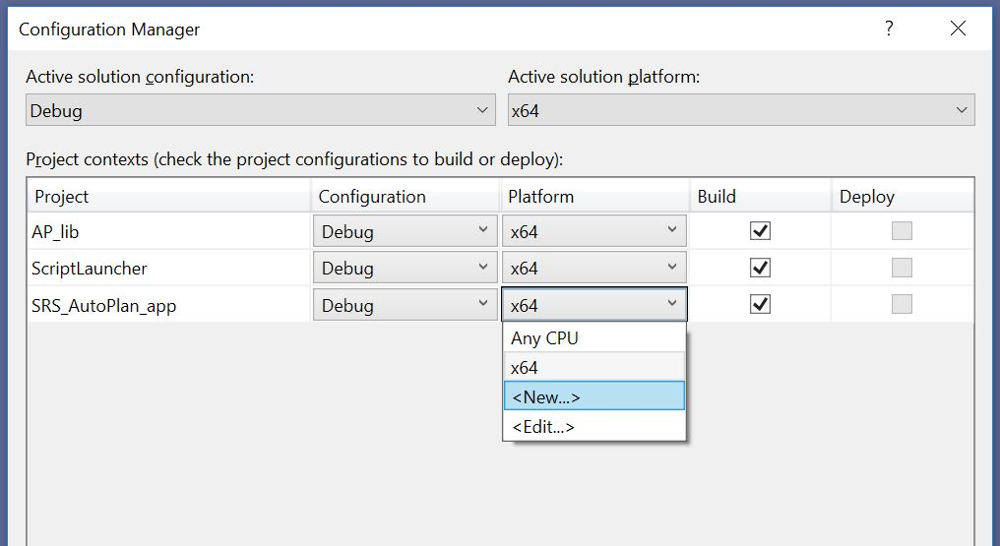
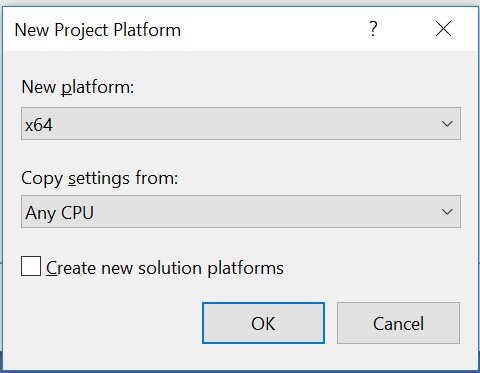



    <h1 style="font-size: 48px; border-bottom: none; margin: 0px 0px 200px 0px;">DVH Batch Export
     Standalone ESAPI app
     Deployment Guide</h1>
    <h2 style="font-size: 24px; border-bottom: none; margin: 0;">Department of Radiation Oncology</h2>
    <h2 style="font-size: 20px; border-bottom: none; margin: 0;">University of Michigan</h2>
    <h3 style="font-size: 20px; border-bottom: none; margin: 10;">Jan 12, 2026</h3>

# Disclaimer

 NOTICE: © 2022 The Regents of the University of Michigan

 The Chuck Mayo Lab - https://medicine.umich.edu/dept/radonc/research/research-laboratories/physics-laboratories 

 The software is solely for non-commercial, non-clinical research and education use in support of the publication.
 It is a decision support tool and not a surrogate for professional clinical guidance and oversight.
 The software calls APIs that are owned by Varian Medical Systems, Inc. (referred to here as Varian),
 and you should be aware you will need to obtain an API license from Varian in order to be able to use those APIs.
 Extending the [No Liability] aspect of these terms, you agree that as far as the law allows,
 Varian and Michigan will not be liable to you for any damages arising out of these terms or the use or nature of the software,
 under any kind of legal claim, and by using the software, you agree to indemnify the licensor and Varian in the event that the
 licensor or Varian is joined in any lawsuit alleging injury or death or any other type of damage (e.g., intellectual property infringement)
 arising out of the dissemination or use of the software.

# Overview

GitHub repository [DVHExportROAR](https://github.com/RadOncDev/DVHExportROAR) contains source code and instructions for compiling and deploying standalone desktop application **DVHExportROAR** and related files, which can be used to extract DVH data from a thick Eclipse client.

The software is solely for non-commercial, non-clinical research and education use in support of the publication.

- [Overview](#overview)
- [Compile the code](#compile-the-code)
- [Configuration](#configuration)
- [Script Approval](#script-approval)
- [Script Launcher](#script-launcher)

# Compile the code

Clone from GitHub repository [DVHExportROAR](https://github.com/RadOncDev/DVHExportROAR) to a local machine where Varian Eclipse treatment planning system is installed (thick Eclipse client).

Open the solution file **DVHExportROAR.sln** with [Visual Studio](https://visualstudio.microsoft.com/). 

    

 

The code needs to be compiled with x64 configuration. Open **Configuration Manager** and make sure each project have **Platform** set as **x64**.

    

 

If you don't see **x64** exist in the pulldown list, create it from \<New...\> option.

    

 

Create x64 platform by 'Copy settings from' Any CPU. Click OK.

    

 

Make sure **x64** is selected for all projects in this solution:

    

 

Add reference to two VMS.TPS dll files. (If you are on a thick client where Eclipse is installed locally, this should happen automatically when you build the solution, since the two dlls are already in system GAC. If not, manually locate these two dll on your machine.)

    

 

Add the same dll reference for project **AP_lib**.

Set project **DVHExportROAR_app** as **startup** project, build the solution and Start. (This only happens on a thick Eclipse client. If not, build the project and see section below about **Script Launcher**)

    

 

You should be able to see the following UI panel for interaction:

    

 

If you build and run successfully. You should be able to see the following files in folder `\DVHExportROAR_app\bin\x64\Debug`:

    

 

- **Exe file** - The resulting `AutoPlan_SRS_v1.1.51.2.exe` and `AP_lib_v1.1.51.2.dll`. These two files will need to be approved for usage in Clinic Eclipse environment.
  
- **Configuration file** -  `AutoPlan_SRS_v1.1.51.2.exe.config`

- **Log file** - per user log file (will be created when a user first use the script)

- **Script Launcher** - `Launcher_AutoPlan_SRS_v1.1.51.2.esapi.dll` (copied from folder `\ScriptLauncher\bin\x64\Debug`)

# Configuration