

    <h1 style="font-size: 48px; border-bottom: none; margin: 0px 0px 200px 0px;">DVH Batch Export
     Standalone ESAPI app
     Deployment Guide</h1>
    <h2 style="font-size: 24px; border-bottom: none; margin: 0;">Department of Radiation Oncology</h2>
    <h2 style="font-size: 20px; border-bottom: none; margin: 0;">University of Michigan</h2>
    <h3 style="font-size: 20px; border-bottom: none; margin: 10;">Jan 12, 2026</h3>

# Disclaimer

 NOTICE: © 2022 The Regents of the University of Michigan

 The Chuck Mayo Lab - https://medicine.umich.edu/dept/radonc/research/research-laboratories/physics-laboratories 

 The software is solely for non-commercial, non-clinical research and education use in support of the publication.
 It is a decision support tool and not a surrogate for professional clinical guidance and oversight.
 The software calls APIs that are owned by Varian Medical Systems, Inc. (referred to here as Varian),
 and you should be aware you will need to obtain an API license from Varian in order to be able to use those APIs.
 Extending the [No Liability] aspect of these terms, you agree that as far as the law allows,
 Varian and Michigan will not be liable to you for any damages arising out of these terms or the use or nature of the software,
 under any kind of legal claim, and by using the software, you agree to indemnify the licensor and Varian in the event that the
 licensor or Varian is joined in any lawsuit alleging injury or death or any other type of damage (e.g., intellectual property infringement)
 arising out of the dissemination or use of the software.

# Overview

GitHub repository [DVHExportROAR](https://github.com/RadOncDev/DVHExportROAR) contains source code and instructions for compiling and deploying standalone desktop application **DVHExportROAR** and related files, which can be used to extract DVH data from a thick Eclipse client.

The software is solely for non-commercial, non-clinical research and education use in support of the publication.

# Compile the code

Clone from GitHub repository [DVHExportROAR](https://github.com/RadOncDev/DVHExportROAR) to a local machine where Varian Eclipse treatment planning system is installed (thick Eclipse client).

Open the solution file **DVHExportROAR.sln** with [Visual Studio](https://visualstudio.microsoft.com/). 

    

 

The code needs to be compiled with x64 configuration. Open **Configuration Manager** and make sure each project have **Platform** set as **x64**.

    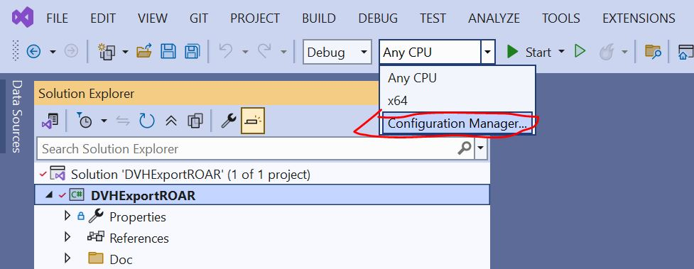

 

If you don't see **x64** exist in the pulldown list, create it from \<New...\> option. Create x64 platform by 'Copy settings from' Any CPU. Click OK.

    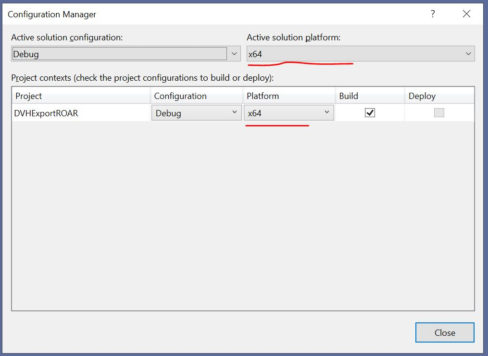

 

Make sure **x64** is selected before you build the solution:

    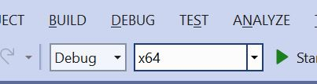

 

 
Add reference to two VMS.TPS dll files. (If you are on a thick client where Eclipse is installed locally, this should happen automatically when you build the solution, since the two dlls are already in system GAC. If not, manually locate these two dll on your machine.)

Build this solution/project. You should see the exe file produced in `bin\debug`:

    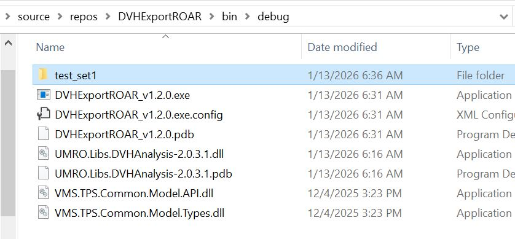

 

# How to use

## Set up folder and prepare input file of plan list

In the same folder with the exe file, create a new folder (e.g. test_set1). Then in a GitBash terminal, change directory (cd) to the 'test_set1' folder:

Create a list of plans/plansums you want to process and put it in a text file, e.g. planlist.txt, as in the following example. Requirements for this file are:

1. Each row should have 5 **tab-delimited** columns: PatientMRN (tab) CourseID (tab) Plan/PlanSumID (tab) NA (tab) NFraction. The 4th column is not used (NA is just a placeholder).
2. Rows need to be sorted by first column **PatientMRN**, so that the plans/plansums of the same patient have to stay together.

    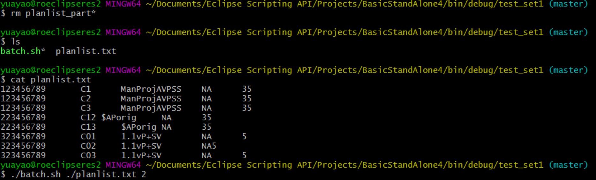

 

## Run the script
Copy `batch.sh` script file from `resources` folder to `test_set1`. Execute the batch.sh script with 2 arguments: (1) inputlist file (e.g. ./planlist.txt) (2) number of instances to run (this is ideally the number of CPU cores on your machine, I used 2 as an example in the above screenshot).

This batch.sh file takes the plan list in planlist.txt, splits it into n smaller chunks, and processes each one with a CPU core. Each core runs an instance of `DVHExportROAR_v1.2.0.exe` whose standard output is piped into `output_i.txt` file and standard error is piped into `log_i.txt` file.

In a testing case of processing 5000 plans on a machine with 6 CPU cores and 32GB memory. It took about 12 hours to finish (different core finishes at a different pace)

    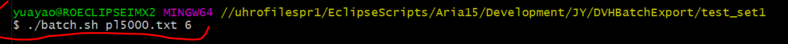

 

## Monitor the progress

You can monitor the progress with command `wc -l * `, which shows how many lines in each file:

    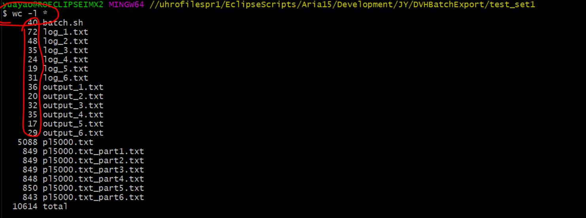

 

or you can use command `tail *log* -n 50 | grep ')'` to peek the end of the log_i.txt files. In the following example, (318/529) shows the 318th patient out of 535 total is now being processed in this CPU instance:

    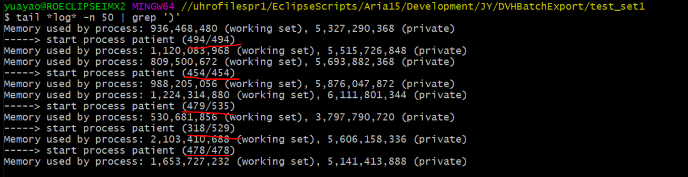

 

And you may want to check the Windows TaskManager to see if memory is enough: (memory consumption will keep increasing, if it's not enough, reduce number of plans in the list, or reduce the instance from 6 to 3.)

    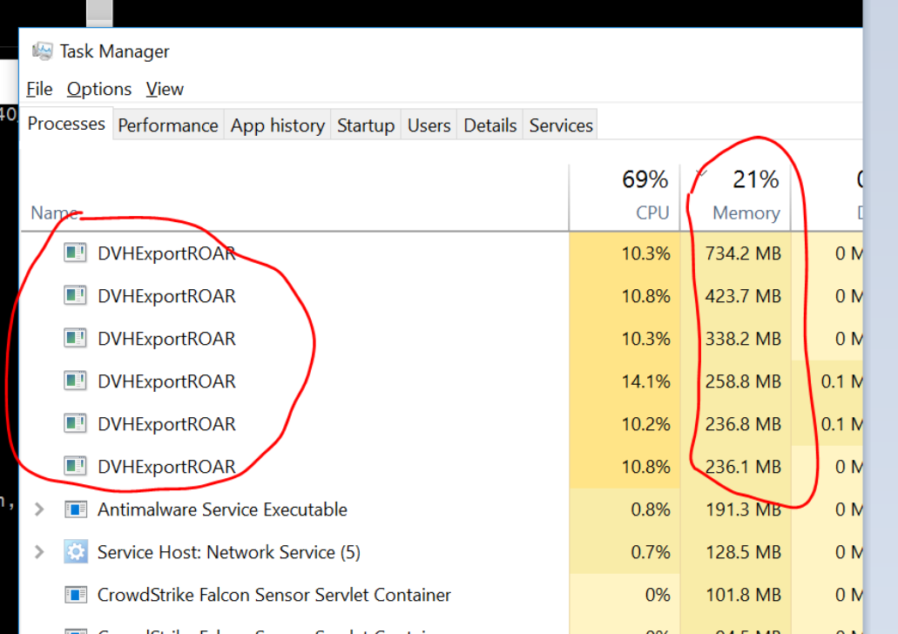

 

If error happens, check the log_i.txt files for more detailed info.

# Check the Output

Extracted DVH curves are stored in the `output_i.txt` files. Each line contains DVH info of one structure, which has the following **tab-delimited** columns:

    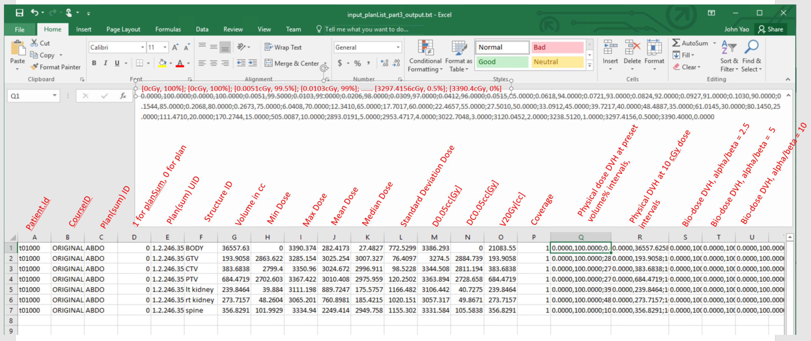

 

In the above example, you see dose data in 'cGy' unit. After version 1.2.0, all output files have dose in Gy, even if the host Eclipse environment has cGy in system setting.

To ensure the completion of the extraction, check the tail of each `log_i.txt` file. You should see the following message:

    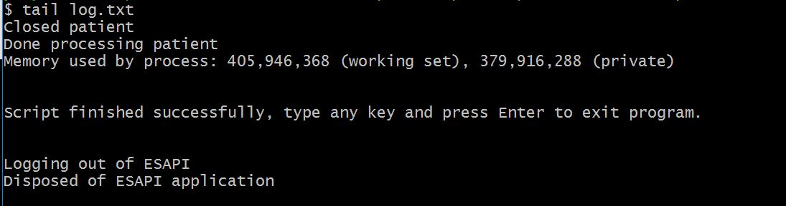

 

